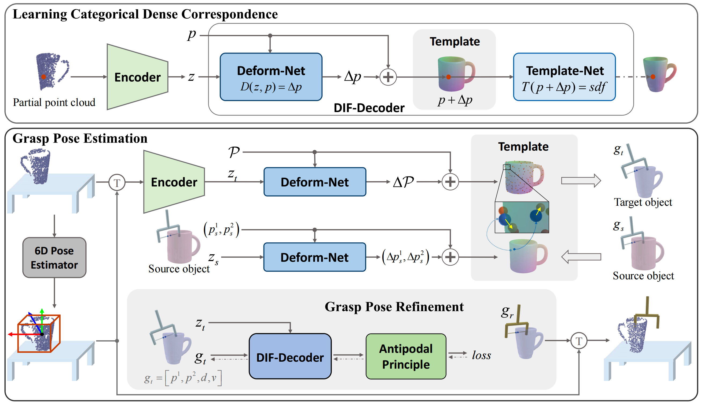

# TransGrasp

This is the implementation of "TransGrasp: Grasp Pose Estimation of a Category of Objects by Transferring Grasps from Only One Labeled Instance" (ECCV 2022).

## Contents

1. [Overview](#overview)

2. [Requirements](#requirements)

3. [Data Preparation](#data-preparation)

4. [Training--Learning Categorical Dense Correspondence](#training--learning-categorical-dense-correspondence)

5. [Inference--Grasp Pose Estimation](#inference--grasp-pose-estimation)

6. [Experiments (in simulation)](#experiments-in-simulation)

7. [Acknowledgments](#acknowledgments)

8. [Citation](#citation)

9. [License](#license)

## Overview

Grasp pose estimation is an important issue for robots to interact with the real world. However, most of existing methods require exact 3D object models available beforehand or a large amount of grasp annotations for training. To avoid these problems, we propose TransGrasp, a category-level grasp pose estimation method that predicts grasp poses of a category of objects by labeling only one object instance. Specifically, we perform grasp pose transfer across a category of objects based on their shape correspondences and propose a grasp pose refinement module to further fine-tune grasp pose of grippers so as to ensure successful grasps. Experiments demonstrate the effectiveness of our method on achieving high-quality grasp with the transferred grasp poses.

<p align="center">

    <h5 align="center">Overview of the proposed TransGrasp</h5>
</p>

## Requirements

- Ubuntu 18.04 or 20.04

- Python 3.7

- PyTorch 1.8.1

- [PyTorch3D](https://github.com/facebookresearch/pytorch3d)

- torchmeta 1.8.0

- [Isaac Gym](https://developer.nvidia.com/isaac-gym) 1.0.preview2 ([Google](https://drive.google.com/file/d/1_ce04VFXZVUiESOqthkbgVBGCx8ZpMu-/view?usp=sharing) | [Baidu:lf30](https://pan.baidu.com/s/1Wr4q8v4nUKG9wXLb5TIElQ))

- NVIDIA driver version >= 460.32

- CUDA 10.2

Use `conda` to create a virtual environment, installing the essential packages:

```shell
conda create -n transgrasp python=3.7
conda activate transgrasp

cd path/to/TransGrasp
conda install pytorch==1.8.1 torchvision==0.9.1 cudatoolkit=10.2 -c pytorch
conda install -c fvcore -c iopath  -c conda-forge fvcore iopath
conda install pytorch3d -c pytorch3d
pip install -r requirements.txt

# Install Isaac Gym (isaacgym/docs/install.html):
cd path/to/isaacgym/python
pip install -e .
# For Ubuntu 20.04, which does not have a libpython3.7 package, you need to set the LD_LIBRARY_PATH variable appropriately:
export LD_LIBRARY_PATH=/home/you/anaconda3/envs/transgrasp/lib
```


## Data Preparation

- Download [pre-aligned mesh models](http://download.cs.stanford.edu/orion/nocs/obj_models.zip) from [ShapeNetCore](https://shapenet.org/download/shapenetcore) dataset.

- Download source meshes and grasp labels for mug, bottle and bowl categories ([Google](https://drive.google.com/file/d/1XcZiOeSo7s9ifvt6ZmxmnJVQyyx2Ab2c/view?usp=sharing) | [Baidu:7qcd](https://pan.baidu.com/s/15tCmjxUK9U0kbnlbuRRtPw)) from [ShapeNetSem](https://shapenet.cs.stanford.edu/shapenet/obj-zip/ShapeNetSem.v0/models-OBJ.zip) and [ACRONYM](https://sites.google.com/nvidia.com/graspdataset) dataset.

- Set the parameters in `scripts/preprocess_data_*.sh` according to the practical cases before runnig the following commands for data preparation.

    (*Here we take **mug** as an example.*)

    ```shell
    # For inference only, run:
    sh scripts/preprocess_data_eval.sh mug

    # For training & inference, run:
    sh scripts/preprocess_data.sh mug 
    ```

## Training--Learning Categorical Dense Correspondence

- To train & evaluate **DIF-Decoder**, run the following commands.

    ```shell
    python DIF_decoder/train.py \
    --config DIF_decoder/configs/train/mug.yml

    python DIF_decoder/evaluate.py \
    --config DIF_decoder/configs/eval/mug.yml
    ```

- To train **Shape Encoder**, run the following commands.

    ```shell
    python shape_encoder/write_gt_codes.py \
    --category mug \
    --config DIF_decoder/configs/generate/mug.yml

    python shape_encoder/train.py --category mug --model_name mug
    ```

- To train **6D Pose Estimator**, run the following command.

    ```shell
    python pose_estimator/train.py --category mug --model_name mug
    ```

## Inference--Grasp Pose Estimation

Before inference, train the networks mentioned above or just download our `pretrained models` ([Google](https://drive.google.com/file/d/1th3lFfN84a6B0zAxhZx-TWzJvGame9VJ/view?usp=sharing) | [Baidu:6urd](https://pan.baidu.com/s/1tWMTgMWNdvk1cECrverT5w)). And arrange the `pretrained models` as follows:

```
|-- TransGrasp
    |-- DIF_decoder
        |-- logs
            |-- bottle
            |-- bowl
            |-- mug
                |-- checkpoints
                    |-- model.pth
    |-- shape_encoder
        |-- output
            |-- bottle
            |-- bowl
            |-- mug
                |-- checkpoints
                    |-- model.pth
    |-- pose_estimator
        |-- output
            |-- bottle
            |-- bowl
            |-- mug
                |-- checkpoints
                    |-- model.pth
```

Additionally, please download the `assets` we used for Isaac Gym ([Google](https://drive.google.com/file/d/1BRnbLBOXCJMarIXfZR_47px8qJJfp0pF/view?usp=sharing) | [Baidu:jl7r](https://pan.baidu.com/s/1WsJovVuUAleZSojiCj_XPw)) before putting the `assets` folder under [./isaac_sim/](./isaac_sim/).

Then, you can run the commands below to generate grasp poses following the procedures in our paper.

1. **Grasp Representation.**  Run the following command to convert grasp represetation, filter source grasps and transfer grasps on source model to the Template Field.

    ```shell
    sh scripts/preprocess_source_grasps.sh mug
    ```

2. **Grasp Transfer**. Run the following command to transfer grasps on the Template Field to target models.

    ```shell
    ENCODER_MODEL_PATH=./shape_encoder/output/mug/checkpoints/model.pth

    python grasp_transfer/transfer_main.py \
    --category mug \
    --shape_model_path ${ENCODER_MODEL_PATH}
    ```

3. **Grasp Refinement**. Run the following command to refine the grasps transferred from the source model.

    ```shell
    python grasp_transfer/refine_main.py --category mug
    ```

4. **Grasp Pose Estimation** with the selected best grasp. After running the following command, the selected grasps will be saved in `grasp_data/mug_select/`.

    ```shell
    ENCODER_MODEL_PATH=./shape_encoder/output/mug/checkpoints/model.pth
    POSE_MODEL_PATH=./pose_estimator/output/mug/checkpoints/model.pth

    python grasp_transfer/main.py \
    --category mug \
    --shape_model_path ${ENCODER_MODEL_PATH} \
    --pose_model_path ${POSE_MODEL_PATH}
    ```

## Experiments (in simulation)

1. **Ablation Study**. The experiments include *Direct Mapping (+refine)* and *Grasp Transfer (+refine)*. Results will be saved in `./isaac_sim/results/`.

    ```shell
    # Parameters: 1. category_name 2. exp_name
    sh scripts/run_ablations.sh mug mug
    ```

2. **Comparison with other grasp pose estimation methods**.  Run the following commands to test the best grasp for every object generated by our proposed **TransGrasp**.

    *Note that Isaac Gym performs convex decomposition for mesh during the first simulation, which takes a long time. Please be patient.*

    ```shell
    python isaac_sim/sim_all_objects_best_grasp.py \
    --category mug \
    --pkl_root grasp_data/mug_select
    ```

## Acknowledgments

This repo is based on [DIF-Net](https://github.com/microsoft/DIF-Net), [PointNet](https://github.com/charlesq34/pointnet), and [object-deformnet](https://github.com/mentian/object-deformnet). We thanks for their excellent works.

## Citation

```BibTeX
@inproceedings{wen2022transgrasp,
  title={TransGrasp: Grasp Pose Estimation of a Category of Objects by Transferring Grasps from Only One Labeled Instance},
  author={Wen, Hongtao and Yan, Jianhang and Peng, Wanli and Sun, Yi},
  booktitle={Proceedings of the European Conference on Computer Vision (ECCV)},
  year={2022}
}
```

## License

Our code is released under [MIT License](./LICENSE).